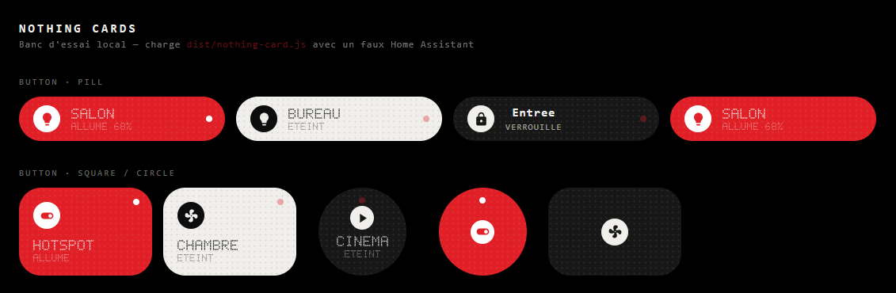
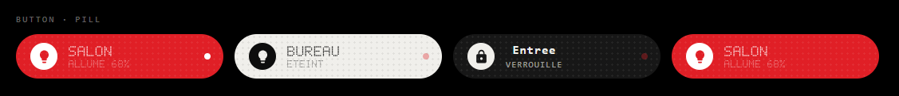
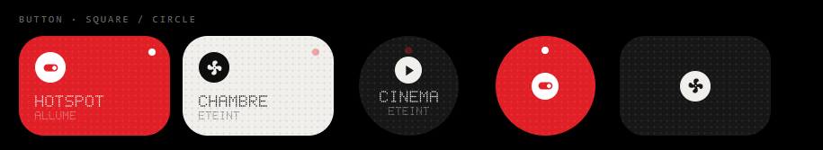
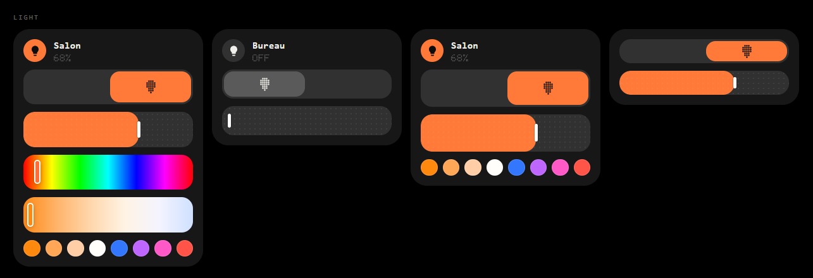
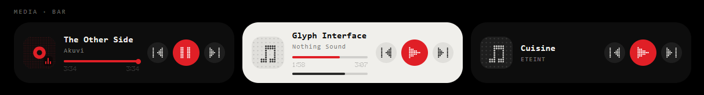
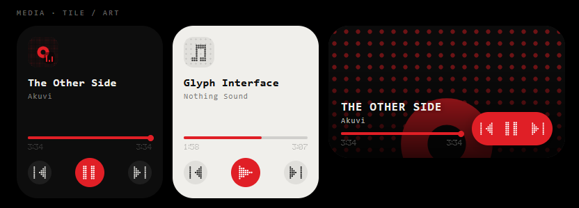
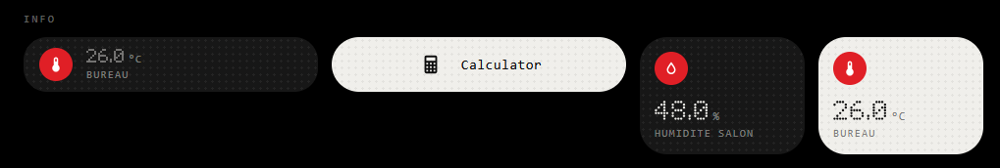
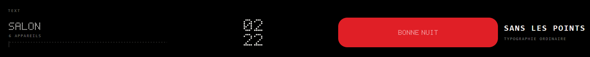
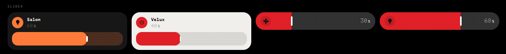
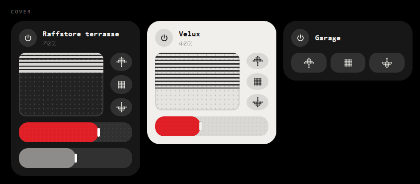

# Nothing Cards for Home Assistant

A set of Lovelace cards built around the Nothing OS look: dot matrix, deep black, off-white, and a single red. No
runtime dependencies — **one file** to drop into `www/`.

  
___
**English** · **[Français](README.fr.md)**

View the live cards: https://messtt.github.io/nothing-card/

**[See the cards live](https://messtt.github.io/nothing-card/)** — the demo runs the real bundle against a fake Home
Assistant: the cards are clickable, draggable, and behave exactly as they will on your dashboard.



---

## The cards

| Card       | YAML type                    | What it does                                                                        |
|------------|------------------------------|-------------------------------------------------------------------------------------|
| **Button** | `custom:nothing-button-card` | On/off button as a pill, square or circle. Configurable tap and hold actions.       |
| **Stats**  | `custom:nothing-stats-card`  | Recorder-backed chart: LED matrix, thin bars or a line.                             |
| **Light**  | `custom:nothing-light-card`  | Light as stacked bars: power, brightness, hue, white, presets.                      |
| **Media**  | `custom:nothing-media-card`  | Media player: artwork, progress, transport, four layouts.                           |
| **Info**   | `custom:nothing-info-card`   | Display only: badge, value, label. No controls.                                     |
| **Text**   | `custom:nothing-text-card`   | Dot-matrix heading, to sit between two sections.                                    |
| **Slider** | `custom:nothing-slider-card` | One large slider. Adapts to the entity's domain.                                    |
| **Cover**  | `custom:nothing-cover-card`  | Roller shutter: drawn slats, up / stop / down, position, tilt.                      |
| **Battery**| `custom:nothing-battery-card`| Charge level: large figure and a pill gauge made of dots.                           |
| **Flow**   | `custom:nothing-flow-card`   | Energy flow: tiles around a ring, lit dots travelling along the links.              |
| **Clock**  | `custom:nothing-clock-card`  | Time, day and date, in five layouts. No entity required.                            |
| **Thermostat** | `custom:nothing-thermostat-card` | Setpoint set by finger on a graduated dial, modes and power.            |
| **Weather**| `custom:nothing-weather-card`| Weather in dots: conditions, hours, days. Five layouts.                             |

All thirteen cards ship in the same file: a single resource to declare.

The dot-matrix type is drawn as SVG from an embedded 5×7 font — nothing to install on the client, and the result is
identical on every device.

---

## Installation

### HACS (custom repository)

1. HACS → ⋮ → **Custom repositories**
2. Repository URL, category **Lovelace**
3. Install *Nothing Cards*, then hard-refresh the browser (`Ctrl` + `F5`)

### Manual

1. Download `nothing-card.js` from the latest *release* (or `dist/nothing-card.js` from the repository) and copy it
   into `<config>/www/`
2. **Settings → Dashboards → ⋮ → Resources → Add resource**
   URL `/local/nothing-card.js` — type **JavaScript Module**
3. Hard-refresh the browser (`Ctrl` + `F5`)

> The Resources menu only appears when **advanced mode** is enabled on your user profile.

---

## Shared options

Two settings apply to **every card**, on top of their own options.

| Option       | Default          | Description                                                     |
|--------------|------------------|-----------------------------------------------------------------|
| `name_dots`  | card-dependent   | Writes the label in dot matrix.                                 |
| `icon_style` | `mdi`            | `mdi` (classic icon) or `dots` (dot-matrix pictogram).          |

```yaml
type: custom:nothing-slider-card
entity: light.salon
name_dots: true
icon_style: dots
```

**`name_dots`** has no fixed default: left alone, each card keeps the rendering it has always had — the **button** and
**stats** cards write their label in dots (following their own `dots` option), the others in ordinary type. Setting it
to `true` or `false` settles it everywhere the same way. The **text** card needs none of this: its `dots` option
already does exactly that.

**`icon_style: dots`** replaces the entity icon with a pictogram drawn on the same 7×7 grid as the controls. The set is
deliberately short — bulb, power, shutter, fan, lock, note — and any unlisted domain falls back to the Nothing dot.
That is the price of a drawing that stays legible at seven dots across: the thousands of MDI icons do not transpose.
With `mdi`, nothing changes.

---

## Nothing Button Card

```yaml
type: custom:nothing-button-card
entity: light.salon
shape: pill        # pill | square | circle
variant: dark      # off-state look: dark | light
```





| Option                       | Default                | Description                                           |
|------------------------------|------------------------|-------------------------------------------------------|
| `entity`                     | —                      | **Required.** Any actionable domain.                  |
| `name`                       | friendly name          | Displayed label.                                      |
| `icon`                       | domain icon            | MDI icon.                                             |
| `shape`                      | `pill`                 | `pill`, `square` or `circle`.                         |
| `variant`                    | `dark`                 | Off state: charcoal or off-white.                     |
| `dots`                       | `true`                 | Dot-matrix type.                                      |
| `show_name` / `show_state`   | `true`                 | Label and state subtitle.                             |
| `show_icon` / `led`          | `true`                 | Icon badge and status dot.                            |
| `accent`                     | `#E01F26`              | On-state colour.                                      |
| `tap_action` / `hold_action` | `toggle` / `more-info` | Standard Lovelace actions.                            |

Toggling adapts to the domain: `scene`, `script`, `button`, `lock`, `cover` and `media_player` get the right service
instead of a generic `homeassistant.toggle`.

`show_name: false` and `show_state: false` together leave nothing but the icon, recentred in the button — a square or
round shortcut, without a word.

---

## Nothing Stats Card

```yaml
type: custom:nothing-stats-card
entity: sensor.house_power
period: hour
points: 24
```

| Option                               | Default              | Description                                           |
|--------------------------------------|----------------------|-------------------------------------------------------|
| `entity`                             | —                    | **Required.** Numeric sensor.                         |
| `chart`                              | `matrix`             | `matrix`, `bars` or `line`.                           |
| `period`                             | `hour`               | `5minute`, `hour`, `day`, `week`, `month`.            |
| `points`                             | `24`                 | Number of columns (4 → 64).                           |
| `rows`                               | `8`                  | Matrix height in LEDs (3 → 16).                       |
| `stat`                               | `mean`               | `mean`, `max`, `min`, `sum`, `change`, `state`.       |
| `value`                              | `state`              | What the large figure shows.                          |
| `baseline`                           | `min`                | `min` zooms on the range, `zero` starts from zero.    |
| `prefix` / `unit` / `decimals`       | —                    | Formatting of the figure.                             |
| `accent` / `up_color` / `down_color` | red / green / red    | Chart and delta colours.                              |
| `labels` / `delta` / `dots`          | `true`               | Time labels, delta, dot-matrix type.                  |

**Three chart styles.** `matrix` is the original LED grid. `bars` puts thin strokes on the baseline — a value at the
floor shrinks to its rounded cap, that is, to a dot, and the tallest one turns red. `line` draws a continuous curve and
marks the current value with a red dot.

```yaml
type: custom:nothing-stats-card
entity: sensor.house_power
chart: bars
points: 48
labels: false
delta: false
```

`bars` and `line` are drawn **in pixels**, at 1:1 with the measured box: strokes keep their width and caps stay round
whatever the tile size. They redraw on resize, where `matrix` instead adapts its number of LED rows. Raise `points` to
tighten the strokes — 48 or 64 give the dense texture of the widgets.

The card queries `recorder/statistics_during_period` (long-term statistics) first and falls back to raw history, which
it aggregates itself, for entities without a `state_class`. It refreshes every 5 minutes plus on every state change,
throttled to one request per minute.

The number of LED rows adapts to the height actually available: the matrix fills the tile without ever overflowing it,
and the dots stay round.

---

## Nothing Light Card

```yaml
type: custom:nothing-light-card
entity: light.salon
```



| Option                                   | Default       | Description                                        |
|------------------------------------------|---------------|----------------------------------------------------|
| `entity`                                 | —             | **Required.** A `light.*` entity.                  |
| `name`                                   | friendly name | Displayed label.                                   |
| `tint`                                   | `true`        | Bars take the lamp's real colour.                  |
| `min_brightness`                         | `1`           | Lowest brightness reachable by dragging.           |
| `accent`                                 | `#E01F26`     | Fallback colour when `tint` is off.                |
| `dots`                                   | `true`        | Percentage in dot matrix.                          |
| `show_icon` / `show_name` / `show_value` | `true`        | The three parts of the header, separately.         |
| `toggle`                                 | `true`        | Power bar.                                         |
| `brightness`                             | `true`        | Brightness bar.                                    |
| `color`                                  | `true`        | Hue strip.                                         |
| `white`                                  | `true`        | White temperature strip.                           |
| `presets`                                | `true`        | Row of colour / white shortcuts.                   |

The card is a stack of bars, with no tabs: a **power switch** whose block slides from one edge to the other, then
**brightness**, **hue**, **white**, and the row of **presets**.

Every element can be switched off on its own, and the tile resizes by itself: `getGridOptions()` measures what is
actually left to show. A bar disappears either because `supported_color_modes` does not announce it, or because you set
it to `false`.

```yaml
# a light reduced to its switch and its brightness
type: custom:nothing-light-card
entity: light.salon
show_icon: false
show_name: false
show_value: false
color: false
white: false
presets: false
```

| Configuration                                   | Grid rows         |
|-------------------------------------------------|-------------------|
| Full RGBWW                                      | 6 (376 px)        |
| RGBWW without hue or white                      | 4 (248 px)        |
| Brightness-only bulb                            | 3 (184 px)        |
| Two bars alone, no header (above)               | 2 (120 px)        |

The hue strip spans all 360 degrees at full saturation: it gives frank colours, and the presets bring the softer tints
and the whites. The first four presets are temperatures (2000, 2700, 4000 and 6500 K), the next four are colours; only
those the lamp can actually render are shown.

Rendering is optimistic and service calls are throttled to one every 180 ms, with a final call on release — the
interface follows the finger without flooding the bus.

> The `wheel_max` option from earlier versions no longer has any effect: the colour wheel gave way to the hue strip. A
> configuration that still mentions it stays valid.

---

## Nothing Media Card

```yaml
type: custom:nothing-media-card
entity: media_player.salon
layout: bar        # bar | wide | tile | art
```





| Option                       | Default                   | Description                                               |
|------------------------------|---------------------------|-----------------------------------------------------------|
| `entity`                     | —                         | **Required.** A `media_player.*` entity.                  |
| `name`                       | friendly name             | Label shown when nothing is playing.                      |
| `layout`                     | `bar`                     | `bar`, `wide`, `tile` or `art`.                           |
| `variant`                    | `dark`                    | Charcoal or off-white background.                         |
| `art`                        | `true`                    | Artwork — a dot-matrix note when there is none.           |
| `controls`                   | `true`                    | Previous / play / next.                                   |
| `progress` / `times`         | `true`                    | Progress bar, position and duration.                      |
| `volume`                     | `false`                   | Volume row with mute.                                     |
| `play_text` / `pause_text`   | empty                     | Optional button label in the `wide` layout.               |
| `dots`                       | `true`                    | Counters in dot matrix.                                   |
| `accent`                     | `#E01F26`                 | Playback and progress colour.                             |
| `tap_action` / `hold_action` | `more-info` / `more-info` | Actions on the artwork and the titles.                    |

The four layouts follow the Nothing widgets: **`bar`** is the wide pill — artwork, titles and progress on the left,
transport on the right; **`wide`** puts the artwork top-right, the title on the left, and a labelled pill button with
double-chevron track buttons at the bottom; **`tile`** is the square, artwork on top and controls at the bottom;
**`art`** spreads the artwork as a background, text and red pill laid over it.

`wide` is laid out as a two-column grid: the artwork gets its own column, the titles and bars the other, the controls
the full width at the bottom. Overlap is therefore impossible by construction — the progress bar stops at the
artwork's edge whatever the number of rows shown, and three grid rows cover every combination, volume included.

Its main button is round and carries the pictogram, like every other layout; give it a `play_text` or a `pause_text`
and it becomes a labelled pill instead.

Each button only appears if the player announces the action in `supported_features`: no "next" arrow on a radio, no
volume slider on a player that has none. The bar only becomes draggable if the player can seek (`SEEK`), with at most
one call every 180 ms and a final call on release.

`media_position` is frozen at the last state change: the card extrapolates the position once a second while playing,
which advances the bar without waking Home Assistant. Series show the show title, then the season and episode; music
shows the track, then the artist.

---

## Nothing Info Card

The card that only displays: a badge, a value, a label. No button, no slider.

```yaml
type: custom:nothing-info-card
entity: sensor.office_temperature
```



| Option                       | Default               | Description                                                    |
|------------------------------|-----------------------|----------------------------------------------------------------|
| `entity`                     | —                     | **Required.** Any domain.                                      |
| `name`                       | friendly name         | Label under the value.                                         |
| `icon`                       | entity icon           | MDI icon of the badge.                                         |
| `attribute`                  | —                     | Shows an attribute rather than the state.                      |
| `layout`                     | `bar`                 | `bar`, `tile` or `pill`.                                       |
| `variant`                    | `dark`                | Charcoal or off-white background.                              |
| `badge`                      | `filled`              | `filled` (red badge), `plain` (icon only), `none`.             |
| `unit` / `decimals`          | the entity's          | Override unit and rounding.                                    |
| `dots`                       | `true`                | Value in dot matrix.                                           |
| `show_value` / `show_name`   | `true`                | Hide either one.                                               |
| `accent`                     | `#E01F26`             | Badge colour.                                                  |
| `tap_action` / `hold_action` | `more-info` / `none`  | Standard Lovelace actions.                                     |

`bar` fits one grid row: badge on the left, value then label on the right. `tile` stacks everything in a square, value
large. `pill` centres the group in a fully rounded pill — with `show_value: false` and `badge: plain`, that is the app
shortcut of the Nothing widgets.

A numeric value is formatted using the Home Assistant locale (`26.0` becomes `26,0` in French); a textual state goes
through its translation (`on` becomes `Allumé`). Since the dot font only knows unaccented capitals, `dots: false` suits
spelled-out states better.

---

## Nothing Text Card

A heading, nothing else. It is the only card in the set that observes no entity: its content comes from the
configuration.

```yaml
type: custom:nothing-text-card
text: Living room
subtitle: 6 devices
rule: true
```



| Option                       | Default          | Description                                                       |
|------------------------------|------------------|-------------------------------------------------------------------|
| `text`                       | —                | **Required.** The heading. A line break adds a line.              |
| `subtitle`                   | —                | Secondary line, always in ordinary type.                          |
| `align`                      | `left`           | `left`, `center` or `right`.                                      |
| `size`                       | `md`             | `sm`, `md` or `lg`.                                               |
| `variant`                    | `none`           | `none` (transparent), `dark`, `light` or `accent`.                |
| `color`                      | theme colour     | Text colour.                                                      |
| `accent`                     | `#E01F26`        | Background of the `accent` variant.                               |
| `dots`                       | `true`           | Dot matrix, otherwise ordinary type.                              |
| `rule`                       | `false`          | Dotted rule under the heading.                                    |
| `tap_action` / `hold_action` | `none`           | With no action configured, the card gets no listener at all.      |

With `variant: none` — the default — the card is transparent and takes the theme's text colour: it sits between two
sections like a subheading, and stays legible on a light dashboard as well as a dark one. The other variants turn it
into a real filled tile.

`getGridOptions()` measures the content (lines, subtitle, rule, padding) and only asks for the rows it needs: one for a
plain heading, two as soon as there is a subtitle at a large size.

Two caveats about the dot font: it only knows unaccented capitals (`É` becomes `E`), and a long heading eventually
shrinks to fit the width. For a full sentence, `dots: false` stays more readable.

---

## Nothing Slider Card

```yaml
type: custom:nothing-slider-card
entity: light.salon
```



| Option                       | Default                   | Description                                             |
|------------------------------|---------------------------|---------------------------------------------------------|
| `entity`                     | —                         | **Required.** An adjustable domain (see below).         |
| `name` / `icon`              | the entity's              | Label and badge icon.                                   |
| `layout`                     | `bar`                     | `bar` (header + bar) or `compact` (bar only).           |
| `variant`                    | `dark`                    | Charcoal or off-white background.                       |
| `tint`                       | `true`                    | The gauge takes the lamp's real colour.                 |
| `min` / `max` / `step`       | the entity's              | Bounds and step, when the entity's do not suit.         |
| `unit`                       | the entity's              | Overrides the displayed unit.                           |
| `dots`                       | `true`                    | Value in dot matrix.                                    |
| `show_icon` / `show_name` / `show_value` | `true`        | Hide any of them.                                       |
| `accent`                     | `#E01F26`                 | Gauge colour when `tint` does not apply.                |
| `tap_action` / `hold_action` | `more-info` / `more-info` | Actions on the label.                                   |

What the slider adjusts depends on the domain, and the card reads the bounds from the right place:

| Domain                   | What it sets      | Service called                 | Bounds                                  |
|--------------------------|-------------------|--------------------------------|-----------------------------------------|
| `light`                  | Brightness        | `light.turn_on`                | 1 – 100 %                               |
| `fan`                    | Speed             | `fan.set_percentage`           | 0 – 100 %, stepped by `percentage_step` |
| `cover`                  | Position          | `cover.set_cover_position`     | 0 – 100 %                               |
| `media_player`           | Volume            | `media_player.volume_set`      | 0 – 100 %                               |
| `number`, `input_number` | Value             | `<domain>.set_value`           | the entity's `min`, `max`, `step`       |
| `climate`                | Setpoint          | `climate.set_temperature`      | `min_temp`, `max_temp`, `target_temp_step` |

Any other domain is rejected at configuration time, with a message naming the accepted ones.

Tapping the **badge** toggles the entity, tapping the **label** opens its more-info dialog, and the **bar** is dragged.
Rendering is optimistic and service calls are throttled to one every 180 ms, with a final call on release: the
interface follows the finger without flooding the bus. The value is snapped to the entity's step — a fan stepped by 10
lands on 40, never on 44.

`layout: compact` reduces the card to the bar itself, badge on the left and percentage on the right laid over it: the
percentage pill of the Nothing widgets, on a single grid row.

---

## Nothing Cover Card

```yaml
type: custom:nothing-cover-card
entity: cover.living_room_shutter
```



| Option                       | Default                   | Description                                          |
|------------------------------|---------------------------|------------------------------------------------------|
| `entity`                     | —                         | **Required.** A `cover.*` entity.                    |
| `name` / `icon`              | the entity's              | Label and badge icon.                                |
| `variant`                    | `dark`                    | Charcoal or off-white background.                    |
| `dots`                       | `true`                    | Position in dot matrix.                              |
| `show_icon` / `show_name` / `show_value` | `true`        | The three parts of the header, separately.           |
| `shutter`                    | `true`                    | The drawn slats.                                     |
| `buttons`                    | `true`                    | Up / stop / down column.                             |
| `slider`                     | `true`                    | Position slider.                                     |
| `tilt`                       | `true`                    | Slat tilt slider.                                    |
| `unknown_position`           | `30`                      | Position drawn when the motor reports none.          |
| `accent`                     | `#E01F26`                 | Fill colour and moving arrows.                       |
| `tap_action` / `hold_action` | `more-info` / `more-info` | Actions on the label.                                |

**The shutter is drawn, not photographed**: a frame, dotted glazing, and thin slats coming down from the top. Its
height follows `current_position` — 30 % open means 70 % of slats. While it moves, the relevant arrow turns red and the
slats breathe.

When the motor supports tilt, **the slat thickness reproduces it**: closed, they touch and the shutter goes opaque;
flat, they let daylight through between two thin lines. The second slider adjusts them.

Each button only appears if `supported_features` announces it, and every element can be switched off in the
configuration. Without the slats, the button column turns horizontal and the card fits two grid rows.

**Controls follow the announced capability, not the current value.** Many motors declare they can set the angle but
only publish `current_tilt_position` after the first movement: gating the slider on the value would hide a control that
works. The tilt slider therefore appears as soon as `SET_TILT_POSITION` is supported, and reads zero until the motor
says otherwise.

**With no position reported** — an `unknown` state, or a motor that only knows open and closed — the drawing would be
an empty frame. `unknown_position` gives it a fallback, 30 % open by default, so the card still reads as a shutter. The
position bar is not fooled by it: it only ever shows what the motor actually reports.

| Configuration                                   | Grid rows         |
|-------------------------------------------------|-------------------|
| Venetian blind, everything shown                | 5 (312 px)        |
| Roller shutter with position                    | 4 (248 px)        |
| Buttons only, no slats and no position          | 2 (120 px)        |

Rendering is optimistic and service calls are throttled to one every 180 ms, with a final call on release.

---

## Nothing Battery Card

```yaml
type: custom:nothing-battery-card
entity: sensor.phone_battery
```

| Option                       | Default                   | Description                                              |
|------------------------------|---------------------------|----------------------------------------------------------|
| `entity`                     | —                         | **Required.** A battery sensor, or an entity carrying `battery_level`. |
| `name`                       | friendly name             | Label above the figure.                                  |
| `attribute`                  | —                         | Attribute to read rather than the state.                 |
| `charging_entity`            | —                         | Entity telling whether the device is charging.           |
| `layout`                     | `bar`                     | `bar` (figure and gauge side by side) or `tile` (stacked). |
| `variant`                    | `dark`                    | Charcoal or off-white background.                        |
| `columns` / `rows`           | `20` / `3`                | Dot grid of the gauge.                                   |
| `low`                        | `20`                      | Below this, the figure turns red.                        |
| `unit`                       | `%`                       | Unit next to the figure.                                 |
| `dots`                       | `true`                    | Level in dot matrix.                                     |
| `show_name` / `show_value` / `show_gauge` | `true`       | Hide any of them.                                        |
| `accent`                     | `#E01F26`                 | Colour of the lit dots.                                  |
| `tap_action` / `hold_action` | `more-info` / `more-info` | Standard Lovelace actions.                               |

The level is read in the order Home Assistant publishes it: the attribute named in the configuration, otherwise
`battery_level` — which most device integrations set — otherwise the state itself for a `device_class: battery` sensor.

**The fill does not lie.** A battery that is not empty keeps at least one lit column, and one that is not full leaves
at least one unlit: at 99 % the gauge shows 19 columns out of 20, never 20. That is what prevents reading a battery as
full when it is not.

**While charging**, a dot-matrix bolt appears next to the figure and the gauge breathes. The state comes from
`charging_entity` if you provide one, otherwise from the entity's `is_charging` or `battery_state` attributes.

---

## Nothing Flow Card

```yaml
type: custom:nothing-flow-card
home:
  entity: sensor.house_power
  energy: sensor.house_energy
  ring: sensor.self_consumption      # the percentage inside the ring
sources:
  - entity: sensor.grid_import
    name: Import grid
    icon: pylon
    energy: sensor.grid_import_kwh
  - entity: sensor.solar
    name: Solar
    icon: sun
    energy: sensor.solar_kwh
consumers:
  - entity: sensor.water_heater
    name: Water heater
    icon: cloud
    slot: ml
  - entity: sensor.car
    name: Car
    icon: car
  - entity: sensor.fridge
    name: Fridge
    icon: fridge
  - entity: sensor.grid_export
    name: Export grid
    icon: bolt
```

| Option                    | Default      | Description                                                       |
|---------------------------|--------------|-------------------------------------------------------------------|
| `sources` / `consumers`   | —            | **At least one entry.** The tile lists, before and after the centre. |
| `home`                    | —            | `{entity, energy, ring, icon}` of the centre. Without `entity`, the sum of the sources. |
| `max_power`               | `3000`       | Power considered "full speed".                                    |
| `speed`                   | `1`          | Dot speed: `2` is twice as fast, `0.5` twice as slow.             |
| `dots_per_line`           | `2`          | Dots in flight on each link.                                      |
| `ring_dots`               | `56`         | Dots of the centre ring.                                          |
| `decimals` / `energy_decimals` | `0` / `1` | Rounding of powers and energies.                                 |
| `variant`                 | `dark`       | Charcoal or off-white background.                                 |
| `dots`                    | `true`       | Values in dot matrix.                                             |
| `footer` / `footer_text`  | `true` / empty | The card footer and the free text left of the clock.            |
| `accent`                  | `#E01F26`    | Colour of the travelling dots.                                    |

Each tile takes `entity` (the power), and optionally `name`, `icon`, `energy` (the kWh line) and `slot`. The slots are
`tl`, `tr`, `ml`, `mr`, `bl`, `bc`, `br` — seven at most around the centre. Without `slot`, sources go to the top then
the left, consumers to the bottom then the right.

**Icons are dot-matrix pictograms**: `pylon`, `sun`, `house`, `car`, `fridge`, `cloud`, `bolt`, `plug`, `battery`… A
name prefixed with `mdi:` switches to the matching classic icon.

**The animation.** A lit dot leaves the source and travels the link to its destination. Its speed follows the power, on
a logarithmic scale — otherwise 10 W and 3000 W would give two animations impossible to tell apart. Below 1 W the link
counts as idle and the dots fade out.

`speed` sets the overall pace without touching the differences between links: at `2`, every duration is halved, and the
largest power stays the fastest. The duration is bounded between 150 ms and 20 s, so an extreme value neither freezes
the dots nor makes them unreadable.

Paths are computed **in pixels**, from the measured positions of the tiles and the ring: they touch the edge of the
circle rather than stopping at its bounding box, and they are re-traced on resize, never on a state change. The dots
follow exactly the same path as the stroke, through `offset-path`.

The visual editor covers the centre and the appearance; `sources` and `consumers` being lists of objects, they are
filled in YAML — `ha-form` cannot edit that kind of structure.

---

## Nothing Clock Card

It observes no entity: the time comes from the device showing the dashboard.

```yaml
type: custom:nothing-clock-card
layout: digital
size: lg
```

| Option                       | Default                    | Description                                                  |
|------------------------------|----------------------------|--------------------------------------------------------------|
| `layout`                     | `digital`                  | `digital`, `stack`, `ring`, `progress` or `week`.            |
| `size`                       | `md`                       | `sm`, `md`, `lg` — digit height.                             |
| `variant`                    | `dark`                     | Charcoal or off-white background.                            |
| `dots` / `date_dots`         | `true` / `false`           | Dot matrix on the digits, and on the date line.              |
| `date` / `weekday`           | `true` / `true`            | The date line, and the weekday inside it.                    |
| `seconds`                    | `false`                    | Show seconds.                                                |
| `hour12`                     | from the language          | Force 12-hour or 24-hour time.                               |
| `periods`                    | day, week, month, year     | The gauges of the `progress` layout.                         |
| `week_start`                 | `monday`                   | `monday` or `sunday`, for the week gauge.                    |
| `cells`                      | `20`                       | Dots per period gauge.                                       |
| `days`                       | `5`                        | Days in the `week` strip.                                    |
| `accent`                     | `#E01F26`                  | Minute marker, current day, leading dot of the gauges.       |
| `tap_action` / `hold_action` | `none`                     | With no action, the card gets no listener at all.            |

**The five layouts.** `digital` writes the time on one line with the date above. `stack` piles the hours over the
minutes. `ring` draws a sixty-dot dial, with the minute hand in red and the hour hand in white on the inner ring.
`progress` shows how far along the day, the week, the month and the year are, each gauge ending on a red dot — that is
where we stand. `week` unrolls a strip of days, today in red under its marker.

**Refreshing is aligned to the next change of unit** — second or minute — instead of waiting on a fixed interval: the
display flips at exactly the right moment, and a clock without seconds does not wake up fifty-nine times for nothing.

Day and month names follow the Home Assistant language, and the 12- or 24-hour format is derived from it unless set
otherwise. The week number is the ISO 8601 one; only the starting day of the **gauge** follows `week_start`, because
that differs from one country to another.

---

## Nothing Thermostat Card

```yaml
type: custom:nothing-thermostat-card
entity: climate.heat_pump
variant: light
```

| Option                                            | Default            | Description                                             |
|---------------------------------------------------|--------------------|---------------------------------------------------------|
| `entity`                                          | —                  | **Required.** A `climate.*` entity.                     |
| `name`                                            | friendly name      | Header label.                                           |
| `variant`                                         | `dark`             | Charcoal or off-white background.                       |
| `min` / `max` / `step`                            | the device's       | Setpoint bounds and step.                               |
| `ticks`                                           | `64`               | Strokes of the graduation.                              |
| `unit`                                            | `°`                | Unit next to the setpoint.                              |
| `decimals`                                        | automatic          | Setpoint rounding.                                      |
| `dots`                                            | `true`             | Figures and labels in dot matrix.                       |
| `show_name` / `show_state` / `show_current` / `show_mode` | `true`     | Hide any of them.                                       |
| `accent`                                          | `#E01F26`          | Graduation and marker while the device heats.           |

**The dial is set by finger.** A 270-degree arc, open at the bottom: the angle of the finger around the centre gives
the setpoint, snapped to the device's step. Outside the arc — in the opening — the value stays at the nearest end, so a
drag below the dial does not send the setpoint from one extreme to the other.

The graduation **ramps up in intensity** to the marker then fades: the eye follows the travel of the setting without
needing one more colour. It turns accent when `hvac_action` is `heating`, blue when it is `cooling`.

**The bottom pill** carries power on the left — it switches off, or back on to the first useful mode the device
declares — and the current mode. Tapping it cycles through `hvac_modes`; holding it opens the entity's more-info
dialog.

Rendering is optimistic and service calls are throttled to one every 200 ms, with a final call on release. Dual
setpoints (`target_temp_low` / `high`) show the low bound: a dial has only one marker.

---

## Nothing Weather Card

```yaml
type: custom:nothing-weather-card
entity: weather.home
layout: full
variant: light
```

| Option                       | Default             | Description                                                  |
|------------------------------|---------------------|--------------------------------------------------------------|
| `entity`                     | —                   | **Required.** A `weather.*` entity.                          |
| `name`                       | friendly name       | The place, under the temperature.                            |
| `layout`                     | `full`              | `full`, `compact`, `hourly`, `daily` or `tile`.              |
| `variant`                    | `dark`              | Charcoal or off-white background.                            |
| `hours` / `days`             | `6` / `3`           | Hourly columns and daily rows.                               |
| `dots` / `decimals` / `unit` | `true` / auto / `°` | Dot matrix, rounding, symbol.                                |
| `show_current`, `show_condition`, `show_range`, `show_name`, `show_hourly`, `show_daily` | layout-dependent | Force a section on, or take it away. |

**The five layouts.** `full` is the complete screen: large pictogram, condition, temperature, hourly strip and daily
rows. `compact` sticks to the present moment. `hourly` and `daily` show a single strip. `tile` fits a square:
pictogram, temperature, extremes.

Sections follow the layout, but any `show_*` overrides it: `layout: hourly` with `show_current: true` puts the present
moment back above the strip.

**The daily bars share a single scale.** A day from 9 to 20 degrees takes more width than one from 12 to 17, and each
bar's position places the day within the week's range — that is what makes them comparable at a glance, which a bar
reset on every row would not allow.

**Forecasts come through a subscription.** Since Home Assistant 2023.9, `attributes.forecast` has gone in favour of
`weather/subscribe_forecast`. The card subscribes for both hourly and daily forecasts, and falls back to the old
attribute array for integrations that still publish it — the gap between two entries is enough to tell hours from days.
An integration that does not provide a type simply leaves that section hidden.

The pictograms cover the Home Assistant conditions, aliases included (`lightning-rainy`, `snowy-rainy`,
`windy-variant`), and fall back to an exclamation mark for the unknown.

---

## Notes

- **Sizing** — every card exposes `getGridOptions()` for the *sections* view and never overflows its tile, whatever
  size is asked for.
- **Visual editor** — all thirteen cards provide `getConfigForm()`: they are configured with the mouse, without going
  through YAML.
- **Pictograms** — the cards' internal controls (arrows, play, pause, volume) are drawn in dot matrix, on the same grid
  as the type. Only entity icons stay MDI: you choose those, so the inventory cannot be closed.
- **Accents** — the 5×7 font has no accented characters (`É` becomes `E`). Use `dots: false` for classic typography.
- **NDot font** — if the *NDot 55* font is installed on the device, text outside the matrix uses it automatically.

---

## Development

Sources live in `src/`, split per card, and are bundled into a single file by Rollup.

```bash
npm install
npm run build      # dist/nothing-card.js
npm run preview    # local test bench, on http://localhost:8137/
```

The test bench is the `index.html` page at the repository root, served as-is by GitHub Pages: it is the same page as
the online demo.

See [DEVELOPERS.md](DEVELOPERS.md) for the source tree and the steps to add a card.

## Licence

MIT.
